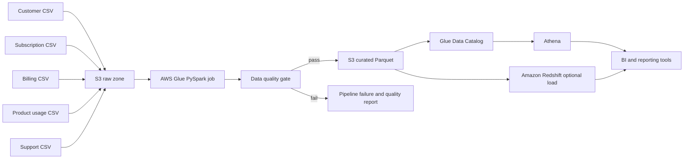

# AWS Data Engineering Architecture

## Business Context

A subscription company receives customer, subscription, billing, product usage, and support data from separate operational sources. The reporting team needs a reliable way to consolidate those datasets, reject invalid records, calculate recurring metrics, and make the results available for SQL analysis.

This project implements that flow as a small AWS data platform.

## Architecture



## Data Zones

The raw S3 bucket keeps the five source datasets separated by prefix. Raw files are not modified in place and bucket versioning retains source history.

The Glue job writes compressed Parquet datasets under:

```text
curated/customer_monthly_metrics/
curated/monthly_kpis/
curated/data_quality/
```

Analytical datasets are partitioned by year and month to reduce Athena data scans.

## Pipeline Stages

1. Generate or receive source files.
2. Run local validation before upload.
3. Upload source files and the Glue job to S3.
4. Run the Glue PySpark job.
5. Validate schemas, keys, customer references, revenue values, and usage ranges.
6. Stop the job if a critical rule fails.
7. Join the five sources into a customer-month analytical model.
8. Write curated Parquet datasets to S3.
9. Run the Glue crawler to update the Data Catalog.
10. Query curated data with Athena.
11. Optionally load curated data into Redshift.

## Data Quality Controls

| Control | Reason |
| --- | --- |
| Required columns | Detect upstream schema changes before transformation |
| Unique business keys | Prevent duplicate customers, events, subscriptions, and tickets |
| Required values | Reject incomplete records in critical fields |
| Customer foreign keys | Detect orphan billing, usage, subscription, or support records |
| Non-negative revenue | Prevent invalid invoice and MRR values |
| Usage ranges | Reject negative activity and adoption scores outside 0-1 |
| Support ranges | Validate severity, resolution time, and CSAT |

Each run writes quality results. Failed checks stop the pipeline before curated tables are replaced.

## AWS Services

### Amazon S3

- Stores raw and curated data.
- Uses server-side encryption and public-access blocking.
- Keeps raw-file versions.
- Transitions curated data to Intelligent-Tiering after 30 days.

### AWS Glue

- Runs the PySpark transformation.
- Applies the cloud data quality gate.
- Writes partitioned Parquet outputs.
- Maintains table metadata through the crawler and Data Catalog.

### Amazon Athena

- Queries curated data directly in S3.
- Uses a dedicated workgroup with encrypted query results.
- Supports KPI, customer-risk, regional-health, and quality-history queries.

### Amazon Redshift

Redshift is optional. SQL files define warehouse tables and `COPY` commands for teams that need repeated BI queries, concurrency, or integration with an existing warehouse.

## Cost And Security

- The default design uses serverless or job-based services.
- Redshift is not provisioned automatically.
- S3 public access is blocked and objects are encrypted.
- The Glue role is limited to the project buckets.
- Athena writes encrypted results to S3.
- No credentials are stored in the repository.

## Verification Scope

Without AWS, the source generation, local quality gate, transformations, SQLite layer, SQL, unit tests, and infrastructure syntax can be verified.

An AWS account is required to create the stack, execute Glue and Athena, load Redshift, and capture cloud execution evidence.
